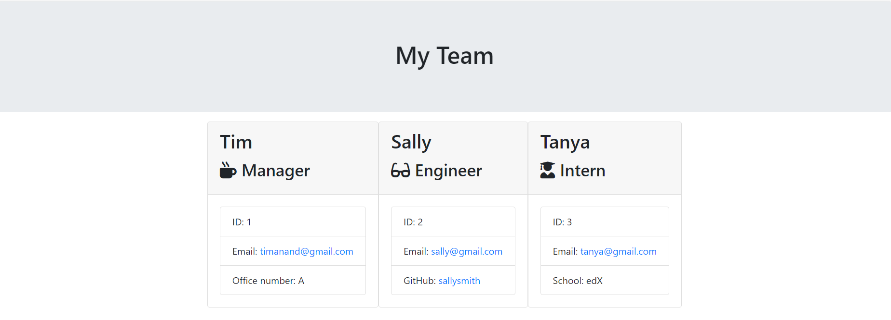

# team-profile-generator
Challenge 12 of edX Boot Camp (Front End) to build a application that generates HTML files using input from a command-line interface. This application will take in information about employees on a software engineering team, then generate an HTML webpage that displays summaries for each person.

> What was my motivation?

My motivation was to accelerate my front end skills in web development so I can successsfully secure a web development job.  I am building on my skills and each week I'm growing from strength to strength and want to achieve top grades throughout all the exercises.

>Why I built this project?

Building the website helped me to bridge the gap between theoretical knowledge and practical of applying
my Javascript, ES6 and Node.js knowledge that I learnt in Weeks 11 and 12, as well as earlier parts of the course.

> What problem did it solve?

It solved the problem of generating a structure of a Team.

> What did I learn?

I learnt about ES6, Jest for TDD, Classes and Object Oriented Programming.

> What makes my project stand out? 

It stands out as I have successfully completed the exercise, used good programming practice in terms of writing clean code. I have used appropriate constants and variables that are understandable. There are comments throughout the code so it can be understood by any developer.  

I have pushed myself continually ensuring my work is of the highest quality. The code is readable and maintainable. 

> Technologies Used

* Javascript
* ES6
* Node.js
* Jest

> Tools Used

* Microsoft Windows 11
* Visual Studio Code
* Git and GitBash
* Git Lab
* Git Hub
* Slack
* Google Chrome Browser

## Installation

The GitHub repository for my Readme Generator can be found at: 
https://github.com/timsbootcamp/team-profile-generator

The source code can be cloned from the above link. 

## Usage

Link to my GitHub Repository: https://github.com/timsbootcamp/team-profile-generator

Screenshot of Passed Tests

Screenshot of Sample Output from 'output\team.html'

## Credits

Inquirer.js
https://www.npmjs.com/package/inquirer

Classes
https://developer.mozilla.org/en-US/docs/Web/JavaScript/Reference/Classes

